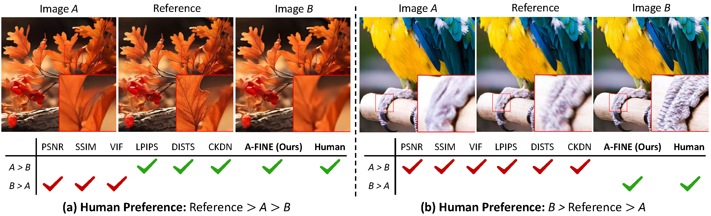

# A-FINE 

**A**adptive **FI**delity-**N**aturalness **E**valuator

Official PyTorch code for our Paper "Toward Generalized Image Quality Assessment:
Relaxing the Perfect Reference Quality Assumption" in CVPR 2025.

### [Paper](https://openaccess.thecvf.com/content/CVPR2025/papers/Chen_Toward_Generalized_Image_Quality_Assessment_Relaxing_the_Perfect_Reference_Quality_CVPR_2025_paper.pdf) | [Supplementary](https://openaccess.thecvf.com/content/CVPR2025/supplemental/Chen_Toward_Generalized_Image_CVPR_2025_supplemental.pdf) | [Project Page](https://tianhewu.github.io/A-FINE-page.github.io/) 

> **Toward Generalized Image Quality Assessment:
Relaxing the Perfect Reference Quality Assumption** <br>
> [Du CHEN\*](https://github.com/ChrisDud0257), [Tianhe WU\*](https://github.com/TianheWu), [Kede MA](https://kedema.org/) and [Lei ZHANG](https://www4.comp.polyu.edu.hk/~cslzhang/). <br>
Accepted by CVPR 2025

## 🆕 News

(2025-04-14) We release the DiffIQA dataset.

(2025-04-14) We release the training, inference code and pretrained models of the Diffusion-based Enhancer.

(2025-04-14) We release the training code of A-FINE.

All of the pretrained models, datasets could be accessed by the following link,

|Project|Link|
|:--:|:--:|
|A-FINE|[Google Drive](https://drive.google.com/drive/folders/14cDC0xUOdABMkV_wsDupn6rFePJslGun?usp=drive_link)|

As for each part in the download link, we will give detailed descriptions about what they are and how to use them.


## ⚡ TODO
- [x] Release DiffIQA dataset.
- [x] Release the inference code and pretrained model of the Diffusion-based Enhancer.
- [x] Release the training code of A-FINE.

## :blush: Introduction

### 1.Example


[//]: # (<div style="text-align: center;"> <span style="color: red;">With the reference image in the middle, which image, A or B, has better perceived visual quality?</span></div>)

[//]: # ()
[//]: # (<p style="text-align:center; color:red;">With the reference image in the middle, which image, A or B, has better perceived visual quality?</p >)

<p align="center">
    With the reference image in the middle, which image, A or B, has better perceived visual quality?
</p>

Image A and B are generated by state-of-the-art generative-based models. While in (b), the generated Image B 
has much better visual quality than the reference image. All of the existing FR-IQA models fail to give an accurate judgement, 
since they only measure the similarity between two images, and assume that the reference image has the best quality. On the contrary,
the proposed A-FINE generalizes and outperforms standard FR-IQA models under both perfect and
imperfect reference conditions. Please zoom in for better visibility.


### 2.Abstract
Full-reference image quality assessment (FR-IQA) generally assumes that reference images are 
of perfect quality. However, this assumption is flawed due to the sensor and optical limitations 
of modern imaging systems. Moreover, recent generative enhancement methods are capable of producing 
images of higher quality than their original. All of these challenge the effectiveness and applicability 
of current FR-IQA models. To relax the assumption of perfect reference image  quality, we build a 
large-scale IQA database, namely DiffIQA, containing approximately $180,000$ images generated by a 
diffusion-based image enhancer with adjustable hyper-parameters. 
Each image is annotated by human subjects as either worse, similar, or better quality compared to its reference. 
Building on this, we present a generalized FR-IQA model, namely **A**daptive **FI**delity-**N**aturalness **E**valuator (A-FINE), 
to accurately assess and adaptively combine the fidelity and naturalness of a test image. 
A-FINE aligns well with standard FR-IQA when the reference image is much more natural than the test image. 
We demonstrate by extensive experiments that A-FINE surpasses standard FR-IQA models on well-established IQA 
datasets and our newly created DiffIQA. To further validate A-FINE, we additionally construct a super-resolution 
IQA benchmark (SRIQA-Bench), encompassing test images derived from ten state-of-the-art SR methods with reliable human 
quality annotations. Tests on SRIQA-Bench re-affirm the advantages of A-FINE.

### 3.Formula
$$
D(ref, dis) = F(ref, dis) + \lambda * N(dis)
$$

$$
\lambda = exp(k(N(ref) - N(dis)))
$$

where $F$ denotes the fidelity term, $N$ denotes the naturalness term, and $k > 0$ is a learnable hyperparameter.
$F$ and $N$ are predicted by deep neural network. $D(ref, dis)$ denotes the A-FINE score. $F \in (-2, 2)$, $N \in (-2, 2)$.

**As for $F$, $N$, $D$, the lower, the better.** 

## 🚀 Quick Start

### 1.Installation
 - python == 3.10
 - PyTorch == 2.0
 - Anaconda
 - CUDA == 11.8

Then install the relevant environments :
```
git clone https://github.com/ChrisDud0257/AFINE
cd QuickInference
conda create --name afine python=3.10
pip install torch==2.0.1 torchvision==0.15.2 torchaudio==2.0.2 --index-url https://download.pytorch.org/whl/cu118
pip install -r requirements.txt
```

### 2. Download the pretrained CLIP model and our A-FINE model.

|      Model       |                                                               Download                                                                |
|:----------------:|:-------------------------------------------------------------------------------------------------------------------------------------:|
| CLIP ViT-B-32.pt | [OPENAI](https://openaipublic.azureedge.net/clip/models/40d365715913c9da98579312b702a82c18be219cc2a73407c4526f58eba950af/ViT-B-32.pt) |
|    afine.pth     |                 [Google Drive](https://drive.google.com/drive/folders/1SgcMmv-9yejHYTT8F8hGN_5Vv8hfGMmR?usp=sharing)                  |

### 3. Inference
For quick test towards any pair of images (distortion, reference), you can run the following command:
```
cd QuickInference
python afine.py --pretrain_CLIP_path [path to the pretrained CLIP ViT-B-32.pt] --afine_path [path to our afine.pth] \
--dis_img_path [path to the distortion image] --ref_img_path [path to the reference image]
```

### 4.Explanations about the final A-FINE score

In very few cases, the reference image is of poor quality, while the distortion image has much 
better quality, then $D(ref, dis)$ will be a considerable negative value. To prevent from numeric overflow, we utilize a non-linear mapping
function to scale it to $D(ref, dis)_{s} \in (0, 100)$.


The lower $D(ref, dis)_{s}$ value, the better quality.

As for the final output, in [afine.py](QuickInference/afine.py), the **afine_all** indicates $D(ref, dis)$, while **afine_all_scale**
indicates $D(ref, dis)_{s}$. You could choose either one of them. If you use A-FINE in your publication, please specific which version
(scaled or not) you are using.

We also provide one pair of testing examples here, the [reference image](figures/online20_Original.png) and [distortion image](figures/online20_RealESRNetx4.png).

Please note that, you cannnot change the path of reference image and distortion image, since A-FINE is an asymmetric FR-IQA model:

$$
D(ref, dis) \neq D(dis, ref)
$$


## 📁 SRIQA-Bench

### 1.Download SRIQA-Bench

| Dataset |                                                 Link                                                 |
|:-------------------------------------------------------------------------------------------------------------------------------------:|:----------------------------------------------------------------------------------------------------:|
|SRIQA-Bench| [Google Drive](https://drive.google.com/file/d/1jOEFy5FOQvQq4h5abGtHFwqo5SFw10nv/view?usp=sharing) |


### 2.Generation progress of SRIQA-Bench

We first compiled $100$ original images covering a wide range of natural scenes and subjected them to common
[Real-ESRGAN degradations](https://github.com/xinntao/Real-ESRGAN) and [BSRGAN degradations](https://github.com/cszn/BSRGAN) to generate
low-resolution (LR) images. We then adopted two regression-based SR methods and eight generative-based (GAN-based/Diffusion-based) models which are 
trained under blind degradations to produce SR results for each LR input:
 

|                                                                                    Regression-based                                                                                     |                                                                                      GAN-based                                                                                      |                                                                          Diffusion-based                                                                          |
|:---------------------------------------------------------------------------------------------------------------------------------------------------------------------------------------:|:-----------------------------------------------------------------------------------------------------------------------------------------------------------------------------------:|:-----------------------------------------------------------------------------------------------------------------------------------------------------------------:|
|                     [SwinIR](https://openaccess.thecvf.com/content/ICCV2021W/AIM/papers/Liang_SwinIR_Image_Restoration_Using_Swin_Transformer_ICCVW_2021_paper.pdf)                     | [Real-ESRGAN](https://openaccess.thecvf.com/content/ICCV2021W/AIM/papers/Wang_Real-ESRGAN_Training_Real-World_Blind_Super-Resolution_With_Pure_Synthetic_Data_ICCVW_2021_paper.pdf) |                                             [StableSR](https://link.springer.com/article/10.1007/s11263-024-02168-7)                                              |
| [RealESRNet/RRDB](https://openaccess.thecvf.com/content/ICCV2021W/AIM/papers/Wang_Real-ESRGAN_Training_Real-World_Blind_Super-Resolution_With_Pure_Synthetic_Data_ICCVW_2021_paper.pdf) |       [BSRGAN](https://openaccess.thecvf.com/content/ICCV2021/papers/Zhang_Designing_a_Practical_Degradation_Model_for_Deep_Blind_Image_Super-Resolution_ICCV_2021_paper.pdf)       | [SUPIR](https://openaccess.thecvf.com/content/CVPR2024/papers/Yu_Scaling_Up_to_Excellence_Practicing_Model_Scaling_for_Photo-Realistic_Image_CVPR_2024_paper.pdf) |
|                                                                                                                                                                                         |           [HGGT](https://openaccess.thecvf.com/content/CVPR2023/html/Chen_Human_Guided_Ground-Truth_Generation_for_Realistic_Image_Super-Resolution_CVPR_2023_paper.html)           |       [SeeSR](https://openaccess.thecvf.com/content/CVPR2024/html/Wu_SeeSR_Towards_Semantics-Aware_Real-World_Image_Super-Resolution_CVPR_2024_paper.html)        |
|                                                                                                                                                                                         |                                                                                                                                                                                     |       [SinSR](https://openaccess.thecvf.com/content/CVPR2024/html/Wang_SinSR_Diffusion-Based_Image_Super-Resolution_in_a_Single_Step_CVPR_2024_paper.html)        |
|                                                                                                                                                                                         |                                                                                                                                                                                     |                    [OSEDiff](https://proceedings.neurips.cc/paper_files/paper/2024/file/a8223b0ad64007423ffb308b0dd92298-Paper-Conference.pdf)                    |

For more details about the generation progress, please refer to the contents of Section 5.2 from the [main paper](https://arxiv.org/pdf/2503.11221) and D parts from the [supplementary](https://arxiv.org/pdf/2503.11221).

### 3.Annotation progress of SRIQA-Bench

For the images with same contents, we ask ten people to rate their visual quality through a complete paired comparison,
resulting in $C_{11}^{2}=55$ pairs of comparisons, resulting in $55 * 100=5500$ pairs of comparisons. Please note that, we also take the original reference image into consideration, thus the image with same contents contains the original reference image (ground truth) 
and ten SR images. Each pair of comparison is annotated by $10$ different people, we final obtain $5500*10=55000$ labels. During the subjective experiment, we ask $40$ people to participate in our task. The software randomly selects two different images from 11 each time without repetition and display them
on the screen. Finally, we obtain $55000$ comparison results. For the total $1100$ images, we compute the MOS score for each image, including the 
original reference image.

|           Type           |Number|
|:------------------------:|:---:|
| Original reference image |100|
|        SR images         |1000|
|       Total images       |1100|
|       __ volunteers take part in the experiment    | 40 |
|   Each pair of comparison is annoated by __ different people| 10 |
|Number of the pair of comparisons|5500|
|    Number of the labels made by human    |55000|
|        MOS scores        |1100|

For more details about the annotation progress, please refer to the contents of Section 5.2 from the [main paper](https://arxiv.org/pdf/2503.11221) and D parts from the [supplementary](https://arxiv.org/pdf/2503.11221).

### 4.Data structure of SRIQA-Bench
The data structure of SRIQA-Bench is as follows:
```
SRIQA-Bench
├── LRImages
│   ├── x1_Original.png
│   ├── x2_Original.png
│   ├── x3_Original.png
│   ├── ...
│   └── x100_Original.png
├── images
│   ├── SwinIR
│   │   ├── x1_SwinIRx4.png
│   │   ├── x2_SwinIRx4.png
│   │   ├── x3_SwinIRx4.png
│   │   ├──...
│   │   └── x100_SwinIRx4.png
│   ├── RealESRNet
│   │   ├── x1_RealESRNetx4.png
│   │   ├── x2_RealESRNetx4.png
│   │   ├── x3_RealESRNetx4.png
│   │   ├──...
│   │   └── x100_RealESRNetx4.png
│   ├──...
│   ├── Original
│   │   ├── x1_Original.png
│   │   ├── x2_Original.png
│   │   ├── x3_Original.png
│   │   ├──...
│   │   └── x100_Original.png
│── MOS
│   ├── x1.txt
│   ├── x2.txt
│   ├── x3.txt
│   ├──...
│   └── x100.txt
│── MOS_Reg
│   ├── x1.txt
│   ├── x2.txt
│   ├── x3.txt
│   ├──...
│   └── x100.txt
│── MOS_Gen
│   ├── x1.txt
│   ├── x2.txt
│   ├── x3.txt
│   ├──...
│   └── x100.txt
```

where ```x1``` to ```x100``` represent the prefix name of different images. The suffix name ```_SwinIRx4``` means that the image is generated by SwinIR under scaling factor $\times 4$. Similarily, other images adhere to identical naming protocols as demonstrated. Specially, ```_Original``` indicates the original
reference image (ground truth) in ```SRIQA-Bench\images\Original``` folder, or the low-resolution image in ```SRIQA-Bench\LRImages``` folder. All of the original image are also saved in ```SRIQA-Bench\images\Original``` folder.

For each comparison group towards the $11$ images with the same contents, we record their MOS scores 
in ```x1.txt``` to ```x100.txt```. Note that, ```MOS/``` folder records the MOS scores of both generative and regression models, ```MOS_Reg/``` folder only records the MOS scores of regression models, ```MOS_Gen/``` folder only rerecords the MOS scores of generative models. We also provide the code towards computation of MOS scores,
```bash
cd TrainAFINE/scripts/process_sriqa
python compute_MOS.py --label_path [path to the label path] --image_path [path to the image path] --save_path [path to the save path]
```
where the label path contains the original comparison results made by human.

Here, to compute MOS scores, we also provide the labels of original comparison results in ```SRIQA-Bench/labels/```, ```A/,B/,C/,D/,E/,F/,G/,H/,I/,J/``` denotes ten different people. The dataset structure could be seen as follows,

```bash
SRIQA-Bench
|── labels
|   ├── A
|   |   ├── x1
|   |   |    ├── x1_SwinIRx4_Original.json
|   |   |    ├── x1_BSRGANx4_Original.json
|   |   |    ├── ...
|   |   ├── x2
|   |   |    ├── x2_SwinIRx4_Original.json
|   |   |    ├── x2_BSRGANx4_Original.json
|   |   |    ├── ...
|   ├── B
|   |   ├── x1
|   |   |    ├── x1_SwinIRx4_Original.json
|   |   |    ├── x1_BSRGANx4_Original.json
|   |   |    ├── ...
|   |   ├── x2
|   |   |    ├── x2_SwinIRx4_Original.json
|   |   |    ├── x2_BSRGANx4_Original.json
|   |   |    ├── ...
|   ├── J
|   |   ├── x1
|   |   |    ├── x1_SwinIRx4_Original.json
|   |   |    ├── x1_BSRGANx4_Original.json
|   |   |    ├── ...
|   |   ├── x2
|   |   |    ├── x2_SwinIRx4_Original.json
|   |   |    ├── x2_BSRGANx4_Original.json
|   |   |    ├── ...
```


Note that, your computaion results of MOS might be a slightly different from us, since the MOS scores are derived using a convex optimization progress, but this is not a problem since the difference in results is very small. However, we still strongly recommand you to direcrly use the MOS scores provided by us.


**The MOS score is varied in $(0, 100)$, the higher, the better.**


### 5.Other Declarations

**Copyright, License and Agreement for the SRIQA-Bench dataset Usage**

1. Please note that this dataset is made available for non-commercial academic research purposes ONLY.
2. You agree not to reproduce, duplicate, copy, sell, trade, resell or exploit for any commercial purposes, any portion of the images and any portion of derived data.
3. You agree not to further copy, publish or distribute any portion of the SRIQA-Bench dataset. Except, for internal use at a single site within the same organization it is allowed to make copies of the dataset.
4. The image contents are released upon request for research purposes ONLY.
5. Any violation of this protocol will be at his own risk. If any of the images include your information and you would like to remove them, please kindly inform us, and we will remove them from our dataset immediately.

**Towards the MOS scores for different methods**

Please note that, since every pretrained SR models are trained under different degradation conditions, some with weak degradation factors (such as HGGT), some with strong degradation factors (such as RealESRGAN),
and we just generate LR images just with our own settings, then the final MOS scores just indicate the quality of the generated SR images under this specific situations.

The primary purpose of establishing SRIQA-Bench is to evaluate the performance of different Full-Reference Image Quality Assessment (FR-IQA) methods, rather than to compare the superiority or inferiority of different SR models. 
The comparative results in SRIQA-Bench may not adequately reflect the performance differences between different SR models as follows:

(1). Limited Test Coverage: We only use 100 low-resolution (LR) images, which cannot fully cover diverse testing scenarios.

(2). Self-Defined Degradation Parameters: The blind degradation parameters (e.g., blur, noise, downscaling) are independently set by us, potentially introducing bias.

Given this, we have no intention of comparing SR models' performance. We hope the Mean Opinion Score (MOS) results from SRIQA-Bench will not be misinterpreted as an evaluation of SR models themselves.


## 📁 DiffIQA

### 1. Download DiffIQA
|Dataset|Link|
|:--:|:--:|
|DiffIQA|[Google Drive](https://drive.google.com/drive/folders/1vZehlUPDyDfo6Mq1K8pAMe3pcjqdDRht?usp=drive_link)|

### 2. Generation progress of DiffIQA
We train a Diffusion-based Enhancer to generate $6$ images with different qualities for each reference as input. As for the detailed generation progress of DiffIQA, please refer to Section.1 in **Pipeline of A-FINE**.

### 3. Annotation progress of DiffIQA
For each pair of comparison, we ask $3$ people to compare the relative quality between each generated image and the reference. As for the detailed annotation progress of DiffIQA, please refer to Section.2 in **Pipeline of A-FINE**.

|           Type           |Number|
|:------------------------:|:---:|
| Original reference image |29868|
|        Enhanced images         |179208|
|       Total images       |209076|
|       __ volunteers take part in the experiment    | 240 |
|   Each pair of comparison is annoated by __ different people| 3 |
|Number of the pair of comparisons|179208|
|    Number of the labels made by human    |537624|


### 4. Data structure of DiffIQA

The data structure of the images in DiffIQA is as follows:
```
DiffIQA/images
├── 01
│   ├── x1_01.png
|   ├── x2_01.png
|   ├── x3_01.png
|   |...
├── 02
│   ├── x1_02.png
|   ├── x2_02.png
|   ├── x3_02.png
|   |...
...
├── 06
│   ├── x1_06.png
|   ├── x2_06.png
|   ├── x3_06.png
|   |...
├── Original
│   ├── x1.png
|   ├── x2.png
|   ├── x3.png
...
```
where ```x1,x2...``` denoted the prefix name of different images, ```_01,_02...``` denotes this image is the 1st, 2nd image generated from the same original reference image with different settings.


The data structure of the labels in DiffIQA is as follows:
```
DiffIQA/labels
├── A
│   ├── 01
│   │   ├── x1_01.json
│   │   ├── x2_01.json
│   │   ├── x3_01.json
│   │   ├──...
│   ├── 02
│   │   ├── x1_02.json
│   │   ├── x2_02.json
│   │   ├── x3_02.json
│   │   ├──...
|   B
│   ├── 01
│   │   ├── x1_01.json
│   │   ├── x2_01.json
│   │   ├── x3_01.json
│   │   ├──...
│   ├── 02
│   │   ├── x1_02.json
│   │   ├── x2_02.json
│   │   ├── x3_02.json
│   │   ├──...
|   C
│   ├── 01
│   │   ├── x1_01.json
│   │   ├── x2_01.json
│   │   ├── x3_01.json
│   │   ├──...
│   ├── 02
│   │   ├── x1_02.json
│   │   ├── x2_02.json
│   │   ├── x3_02.json
│   │   ├──...
```
where ```A,B,C``` denotes the annotation comes from different person. ```x1_01.json,x2_01.json``` records the label of ```x1_01.png,x2_01.png``` respectively. For the final annotation of each image, we take the majority of the human subjects.

We record the comparison result in ```xx.json``` file. The contents recorded in the label are as follows,
```bash
{
    "Picture_AI": {
        "Name": "000006x0y770_01.png",
        "File": "01",
        "ImageSize": [],
        "Label": "Positive"
    },
    "picture_Original": {
        "Name": "000006x0y770.png",
        "File": "Original",
        "ImageSize": [],
        "Label": null
    },
    "Time_cost": {
        "Start": "2024-05-08 19:34:49",
        "End": "2024-05-08 19:34:50",
        "Total": 1.5
    }
}
```
where ```Picture_AI``` indicates the generated image, while ```picture_Original``` denotes the original reference image, the comparison results are shown in ```Picture_AI/Label```, the comparison principle is :

|           Type           |Label|
|:------------------------:|:---:|
| Reference > Generated |Negative|
|        Reference = Generated        |Similar|
|       Reference < Generated       |Positive|

So the **comparison result indicates whether the generated image has better quality than the reference one**. 

If the generated one is better, then the label in ```Picture_AI/Label``` will be "Positive". Else if the generated one is worse, then the label in ```Picture_AI/Label``` will be "Negative".

### 5 Other Declarations

**Copyright, License and Agreement for the DiffIQA dataset Usage**

1. Please note that this dataset is made available for non-commercial academic research purposes ONLY.
2. You agree not to reproduce, duplicate, copy, sell, trade, resell or exploit for any commercial purposes, any portion of the images and any portion of derived data.
3. You agree not to further copy, publish or distribute any portion of the DiffIQA dataset. Except, for internal use at a single site within the same organization it is allowed to make copies of the dataset.
4. The image contents are released upon request for research purposes ONLY.
5. Any violation of this protocol will be at his own risk. If any of the images include your information and you would like to remove them, please kindly inform us, and we will remove them from our dataset immediately.

## 🖥️ Pipeline of A-FINE

There are total three steps to obtain our final A-FINE model, and one more step to output the scores in your own projects:
1. Train and infer the Diffusion-based enhancer to generate our DiffIQA dataset.
2. Human annotation progress of the DiffIQA dataset.
3. Train A-FINE and test it towards the accuracy metrics on different benchmarks.
4. Utilize A-FINE to evaluate your own results.
We will give detailed descriptions about the four steps in the following.

### 1. Train and infer the Diffusion-based Enhancer to generate our DiffIQA dataset.

#### 1.1 Training Enhancer
Firstly, please follow this [instruction](DiffEnhancer/datasets/README.md) to prepare the training datasets. All of the download links of the training images are also provided in the [instruction](DiffEnhancer/datasets/README.md).
Secondly, please follow this [instruction](DiffEnhancer/READEME.md) to train the Diffusion-based Enhancer. All of the models which are needed are also provided in this [instruction](DiffEnhancer/READEME.md).

For more details about the training progress, please refer to the contents of Section 3.1 from the [main paper](https://arxiv.org/pdf/2503.11221) and A parts from the [supplementary](https://arxiv.org/pdf/2503.11221).

#### 1.2 Infer Enhancer for generating DiffIQA
Firstly, pleae follow this [instruction](DiffEnhancer/datasets/README.md) to prepare the inference datasets. All of the download links of the inference images are also provided in the [instruction](DiffEnhancer/datasets/README.md).
Secondly, please follow this [instruction](DiffEnhancer/READEME.md) to generate DiffIQA dataset through the well-trained Enhancer. All of the models and datasets which are needed are also provided in this [instruction](DiffEnhancer/READEME.md) and this [instruction](DiffEnhancer/datasets/README.md).

For more details about the generation progress, please refer to the contents of Section 3.2 from the [main paper](https://arxiv.org/pdf/2503.11221) and B parts from the [supplementary](https://arxiv.org/pdf/2503.11221).


### 2. Human annotation progress of the DiffIQA dataset

#### 2.1 Annotation progress
For each single original reference image, we generate six enhanced counterparts with different qualities. During human subjection, each volunteer is asked to **compare one of the enhanced image with the original reference**, and choose which one has better quality. The screen will display the two images in random order without telling which one is the real reference. For each pair of comparison, we ask three different people to give jugdements, and we take the majority selection as the final label.

For more details about the annotation progress, please refer to the contents of Section 3.2 from the [main paper](https://arxiv.org/pdf/2503.11221) and C parts from the [supplementary](https://arxiv.org/pdf/2503.11221).


### 3. Train A-FINE and test it towards the accuracy metrics on different benchmarks

#### 3.1 Train A-FINE

Firstly, please follow this [instruction](TrainAFINE/datasets/README.md) to prepare the training and validation datasets. All of the download links of thoes image are also provided in the [instruction](TrainAFINE/datasets/README.md).

Secondly, please follow this [instruction](TrainAFINE/README.md) to train A-FINE. All of the download links of the pretrained models are also provided in the [instruction](TrainAFINE/datasets/README.md).

#### 3.2 Test A-FINE on different benchmarks to compute its accuracy
Firstly, please follow this [instruction](TrainAFINE/datasets/README.md) to prepare the inference datasets. All of the download links of thoes image are also provided in the [instruction](TrainAFINE/datasets/README.md).

Secondly, please follow this [instruction](TrainAFINE/README.md) to test A-FINE on different benchmarks to compute its accuracy. All of the download links of the pretrained models are also provided in the [instruction](TrainAFINE/datasets/README.md).

### 4. Utilize A-FINE to evaluate your own results

#### 4.1 Merge all of the models into one single file
We have intergrated the different parts of the A-FINE model into a single ```.pth``` file,

```bash
cd TrainAFINE/scripts/merge_pth
python merge_afine.py [for more argument parameters, please refer to this code]
```


#### 4.2 Scale the final A-FINE value
As has been pointed out in QuickInference part, in very few cases, if the reference image is of poor quality, while the generated image has much better quality, then the A-FINE score will be a considerable negative value. To prevent from numerical overflow, we utilize a non-linear mapping function to scale it to $(0, 100)$.
The non-linear mapping function could be seen from [afine.py](QuickInference/afine.py):
```bash
def scale_finalscore(score, yita1 = 100, yita2 = 0, yita3 = -1.9710, yita4 = -2.3734):

    exp_pow = -1 * (score - yita3) / (math.fabs(yita4) + 1e-10)
    if exp_pow >=10:
        scale_score = (yita1 - yita2) * torch.exp(-1 * exp_pow) / (1 + torch.exp(-1 * exp_pow)) + yita2
    else:
        scale_score = (yita1 - yita2) / (1 + torch.exp(exp_pow)) + yita2

    # scale_score = (yita1 - yita2) / (1 + math.exp(-1 * (score - yita3) / (np.abs(yita4)))) + yita2
    return scale_score
```
To complete this step, we need to give a reasonable value for $\eta_{3}, \eta{4}$. We fit the two values on SRIQA-Bench. 

Firstly, please normalize the MOS scores of SRIQA-Bench to $(0, 100)$, the lower, the better,
```bash
cd TrainAFINE/scripts/fit_parameter/normalize_mos
python normalize_SRIQA_mos.py --input_path [path to the original MOS score] --save_path [path to your save path]
```

Secondly, based on the normalized MOS scores from above, please fit the two parameters by this code, 
```bash
cd TrainAFINE/scripts/fit_parameter/fit_beta
python fit_beta_AFINE_Stage3.py --input_img_path [please merge all images of SRIQA-Bench into a single folder] --input_txt_path [path to the normalized MOS score of SRIQA-Bench] --save_path [path to you save path]
```
Then you will obtain the values of $\eta_{3}, \eta{4}$. Please just use the fitted values and write them in the code of [afine.py](QuickInference/afine.py) as follows,
```bash
def scale_finalscore(score, yita1 = 100, yita2 = 0, yita3 = -1.9710, yita4 = -2.3734):

    exp_pow = -1 * (score - yita3) / (math.fabs(yita4) + 1e-10)
    if exp_pow >=10:
        scale_score = (yita1 - yita2) * torch.exp(-1 * exp_pow) / (1 + torch.exp(-1 * exp_pow)) + yita2
    else:
        scale_score = (yita1 - yita2) / (1 + torch.exp(exp_pow)) + yita2

    # scale_score = (yita1 - yita2) / (1 + math.exp(-1 * (score - yita3) / (np.abs(yita4)))) + yita2
    return scale_score
``` 


#### 4.3 Inference A-FINE in your project
Then use our QuickInferece code to infer A-FINE on your images!
```bash
cd QuickInference
python afine.py --pretrain_CLIP_path [path to the pretrained CLIP ViT-B-32.pt] --afine_path [path to our afine.pth] \
--dis_img_path [path to the distortion image] --ref_img_path [path to the reference image]
```


## 📜 License 
This project is released under the Apache 2.0 license.

## 🌏 Citation

```bash
@inproceedings{chen2025toward,
  title={Toward Generalized Image Quality Assessment: Relaxing the Perfect Reference Quality Assumption},
  author={Chen, Du and Wu, Tianhe and Ma, Kede and Zhang, Lei},
  booktitle={Proceedings of the 2025 IEEE/CVF Computer Vision and Pattern Recognition Conference},
  pages={12742--12752},
  year={2025}
}
```

## 📜 Acknowledgement

This project is built mainly based on the excellent [BasicSR](https://github.com/XPixelGroup/BasicSR), [CLIP](https://github.com/openai/CLIP) and [PASD](https://github.com/yangxy/PASD) codeframe. We appreciate it a lot for their developers.

## 📧 Contact

If you have any questions or suggestions about this project, please contact me at ```csdud.chen@connect.polyu.hk``` .
